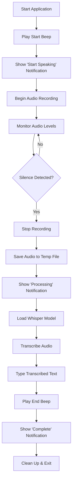

# Whisper Input

A voice-to-text transcription tool that automatically types your spoken words using OpenAI Whisper. This simple Python application is packaged using Nix for maximum ease of use and reproducible builds.

## Quick Start

```bash
nix run github:emailnjv/whisper-input
```

Once you run the command:
1. Wait for a notification telling you to start speaking
2. Start speaking clearly into your microphone
3. Stop speaking when finished
4. A notification will inform you that transcription is complete
5. Your spoken text will be automatically typed in the currently focused text field

## Project Design

### Architecture Overview

The application follows a simple pipeline architecture:

```
Audio Input → Recording → Silence Detection → Transcription → Text Output
```

### Core Components

1. **Audio Recording Module** (`record_speech`)
   - Captures microphone input using PyAudio
   - Implements real-time silence detection
   - Saves audio to temporary WAV file

2. **Transcription Engine** (`transcribe_speech`)
   - Uses OpenAI Whisper for speech-to-text conversion
   - Loads the "base" model for balanced accuracy and performance
   - Processes recorded audio files

3. **Text Input Module** (`type_text`)
   - Simulates keyboard input using pynput
   - Types transcribed text directly into active applications

4. **User Interface** (Notifications & Audio Feedback)
   - Desktop notifications for status updates
   - Optional audio beeps for workflow feedback
   - Visual icons for different states

### Data Flow



## API Integration

### OpenAI Whisper

The application integrates with OpenAI Whisper through the `openai-whisper` Python package:

- **Model Loading**: `whisper.load_model("base")`
  - Uses the "base" model (39 MB) for balanced performance
  - Loaded once per session for efficiency
  - Other available models: tiny, small, medium, large

- **Transcription**: `model.transcribe(file_path)`
  - Processes WAV audio files
  - Returns structured result with transcribed text
  - Handles various audio qualities and languages

### Audio Processing APIs

- **PyAudio**: Cross-platform audio I/O library
  - Format: 16-bit PCM
  - Sample Rate: 44,100 Hz
  - Channels: Mono (1 channel)
  - Buffer Size: 1024 frames

- **Silence Detection**: Custom implementation using RMS (Root Mean Square)
  - Threshold: 500 (configurable)
  - Duration: 5-10 seconds (configurable)

## Setup Requirements

### System Dependencies

#### Linux
```bash
# Ubuntu/Debian
sudo apt-get install portaudio19-dev python3-dev

# Fedora/RHEL
sudo dnf install portaudio-devel python3-devel

# Arch Linux
sudo pacman -S portaudio
```

#### macOS
```bash
brew install portaudio
```

#### Windows
PyAudio wheels are available on PyPI for Windows.

### Nix Environment (Recommended)

The project includes a complete Nix flake for reproducible builds:

```bash
# Development shell
nix develop

# Direct execution
nix run github:emailnjv/whisper-input

# Build locally
nix build
```

### Python Dependencies

If not using Nix, install Python dependencies:

```bash
pip install openai-whisper pyaudio pynput plyer termcolor beepy
```

**Note**: PyAudio installation may require system-level audio development libraries.

## Configuration Options

### Command Line Arguments

```bash
whisper-input [OPTIONS]

Options:
  --silence_duration INT  Duration of silence before stopping recording (seconds) [default: 5]
  --beep                 Enable audio beep feedback at start and end
  --help                 Show help message and exit
```

### Examples

```bash
# Use default 5-second silence duration
whisper-input

# Custom silence duration with beep feedback
whisper-input --silence_duration 3 --beep

# Longer silence duration for slower speech
whisper-input --silence_duration 10
```

### Environment Customization

The application automatically detects:
- Microphone input device (uses system default)
- Temporary directory for audio files
- Desktop notification system
- Icon files location

## Performance Considerations

### Model Selection
- **tiny**: Fastest, least accurate (~39x real-time)
- **base**: Balanced performance (default, ~16x real-time)
- **small**: Better accuracy (~6x real-time)
- **medium**: High accuracy (~2x real-time)
- **large**: Best accuracy (~1x real-time)

### Memory Usage
- Base model: ~1 GB RAM during transcription
- Audio buffer: Minimal (~1 MB for typical recordings)
- Temporary files: Cleaned up automatically

### Latency
- Recording: Real-time with < 100ms latency
- Transcription: Depends on model and audio length
  - Base model: ~2-5 seconds for 10-second audio
- Text input: Near-instantaneous

## Troubleshooting

### Common Issues

1. **No microphone input**
   - Check system audio permissions
   - Verify microphone is not muted
   - Test with other applications

2. **PyAudio installation fails**
   - Install system audio development libraries
   - Use Nix environment for automatic dependency management

3. **Transcription accuracy issues**
   - Speak clearly and at moderate pace
   - Reduce background noise
   - Consider using a larger Whisper model
   - Adjust silence duration for your speaking pattern

4. **Text not typing in application**
   - Ensure target application is focused
   - Check if application accepts programmatic input
   - Some secure applications may block automated input

### Debug Mode

For debugging, the application provides colored terminal output:
- **Yellow**: Configuration warnings
- **Green**: Usage examples
- **Default**: Normal operation status

## Security & Privacy

- **Local Processing**: All transcription happens locally using Whisper
- **No Network Calls**: No data sent to external services
- **Temporary Files**: Audio files are automatically cleaned up
- **Permissions**: Requires microphone and keyboard input access

## Contributing

The project uses Nix flakes for reproducible development environments:

```bash
# Enter development shell
nix develop

# Run locally
python src/whisper-input.py --help

# Test changes
nix build
```

## License

This project follows the same license as its dependencies. Please check individual package licenses for compliance requirements.
